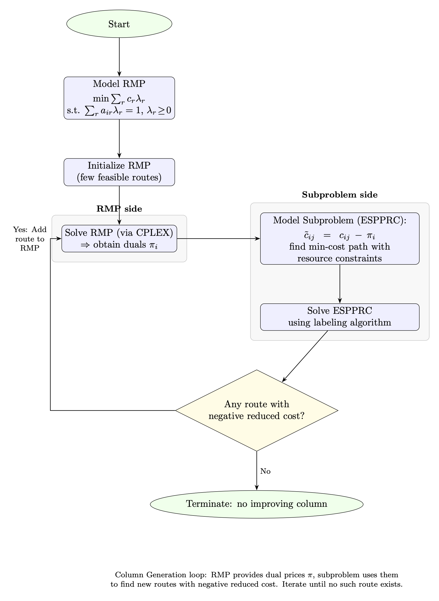
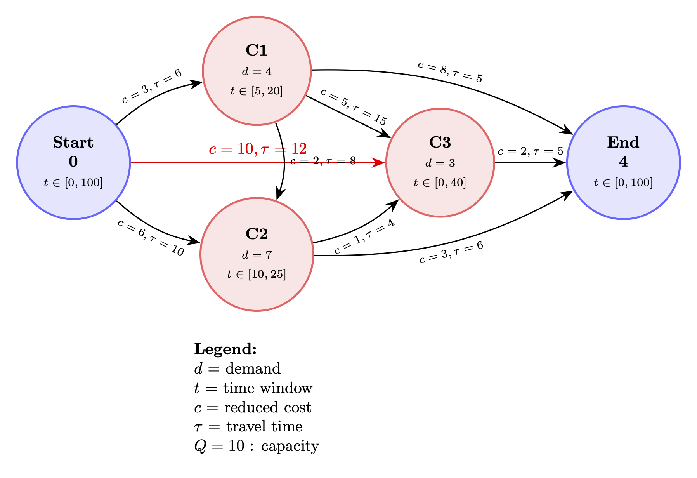

# VRPTW & Variants Solving Framework

This project addresses the **Vehicle Routing Problem with Time Windows (VRPTW)** and its variants by employing a **Dantzig–Wolfe reformulation** combined with a **column generation approach**. In this context, the **pricing problem** is formulated as an **Elementary Shortest Path Problem with Resource Constraints (ESPPRC)**, which can be efficiently solved using a **labeling algorithm**. This approach is foundational in solving VRPTW and related vehicle routing problems.

---

## Design Overview

The framework is designed to be **modular and extensible**, with a clear separation between:

1. **Problem Abstraction** – The **ESPPRC base class** provides generic methods for label initialization, extension, dominance checking, and feasibility verification.
2. **Problem-Specific Implementations** – Each variant, like **ESPPTWC**, extends the base class and defines **resource extension functions (REFs)** and feasibility rules.
3. **Label Representation** – Partial paths are encapsulated in a **Label class**, which stores the current node, resources, and full path, enabling easy manipulation and comparison.
4. **Column Generation Orchestrator** – A **CG orchestrator** coordinates the master problem (linear relaxation), the pricing problem (ESPPRC solved by labeling), and communication with a generic linear solver (currently CPLEX). This allows a plug-and-play, scalable Dantzig–Wolfe workflow for VRPTW and variants.

---

## Project Structure

```
VRPTW/
├── cg_orchestrator.py                # Column Generation orchestrator (top-level workflow)
├── restricted_master_problems/
│   └── set_covering.py               # RMP: Set covering master problem builder
├── solvers/
│   ├── base_solver.py                # Abstract solver interface for LP/MIP
│   └── cplex_solver.py               # Concrete CPLEX solver implementation
├── data/                             # Raw and processed datasets
├── assets/                           # Visualizations of problem data
├── data_processing/                  # Modules to parse and prepare problem data
│   └── __init__.py
├── espprc/                           # Core ESPPRC framework
│   ├── __init__.py
│   ├── base.py                       # Generic ESPPRC base class and Label definition
│   ├── espptwc.py                    # ESPPTWC implementation (Time Windows + Capacity)
│   ├── espprc_solver.py              # Labeling algorithm implementation, including LabelingSolver class
│   ├── problem_data_test.py          # Small test instances for ESPPTWC
├── .gitignore
├── LICENSE
└── README.md
```

> **New:** See [`cg_orchestrator.py`](./cg_orchestrator.py) for the new high-level column generation workflow.

---

## Column Generation Flowchart

The following diagram illustrates the column generation process, showing the interaction between the **Restricted Master Problem (RMP)** and the **Subproblem (ESPPRC)**:



_Figure: Flowchart of the column generation algorithm showing the interaction between the RMP and the subproblem (ESPPRC)._

---

## Core Components

### 1. ESPPRC Base Class (`espprc/base.py`)

The `ESPPRC` class defines a **generic framework** for solving Elementary Shortest Path Problems with Resource Constraints.  
It handles:

- Generic **label initialization** and **extension** via Resource Extension Functions (REFs)
- **Feasibility checks** for all registered resources
- **Dominance filtering** through the `Label` class
- Unified support for **constant** and **node-dependent** resource windows

#### Expected `problem_data` Structure

```python
   {
      "num_customers": int,
      "resource_windows": {
         "constant": {
               <resource_name>: ([lower_bounds], [upper_bounds]),
               ...
         },
         "node_dependent": {
               <resource_name>: ([lower_i, ..., lower_n], [upper_i, ..., upper_n]),
               ...
         }
      },
      "graph": {i: [neighbors], ...},             # adjacency list
      "reduced_costs": {(i, j): float, ...},      # arc cost or reduced cost
      # Optional problem-specific fields (defined by subclasses)
   }
```

> The following graph illustrates how such a `problem_data` structure translates into an ESPPTWC instance, where nodes, arcs, and resource windows correspond to the defined fields.

## 

### 2. Label Class (`espprc/label.py`)

The `Label` class represents a **partial path** (state) during the labeling process.

- Stores **current node**, **path**, and a **resource dictionary** (`Dict[str, np.ndarray]`)
- Implements its own **dominance rule** via `dominates(self, other)`
- Supports deep copies of resource vectors for safe propagation

Example structure:

```python
Label(
    node=3,
    resources={"time": np.array([12.0]), "load": np.array([7.0])},
    path=[0, 1, 3]
)
```

---

### 3. ESPPTWC (`espprc/espptwc.py`)

Implements the **Elementary Shortest Path Problem with Time Windows and Capacity** (ESPPTWC).
This subclass registers **problem-specific REFs** for:

- `time` (scalar, respecting node-dependent time windows)
- `load` (vehicle capacity constraint)
- `reduced_cost` (accumulated reduced cost)
- `is_visited` (vector of visited customers)

---

### 4. Labeling Algorithm & Solver (`espprc/espprc_solver.py`)

Implements a **generic labeling algorithm** to solve ESPPRC instances via the `LabelingSolver` class.

The `LabelingSolver` is now the entry point for solving the pricing problem during column generation.
It exposes:

- Multiple **label selection strategies** (FIFO/LIFO/min resource, etc.)
- A `.solve()` method returning optimal or improving labels for the ESPPRC subproblem
- Simple integration into the column generation workflow (see orchestrator below)

**Example usage:**

```python
from espprc.espptwc import ESPPTWC
from espprc.problem_data_test import problem_data_test_2
from espprc.espprc_solver import LabelingSolver

if __name__ == "__main__":
    problem = ESPPTWC(problem_data_test_2)
    solver = LabelingSolver(problem)
    best_labels, best_reduced_cost = solver.solve()
    print(best_labels)
```

---

### 5. Column Generation Orchestrator (`cg_orchestrator.py`)

**New:** The CG orchestrator brings together all components to implement the complete Dantzig–Wolfe/column generation loop for VRPTW and its variants.

Key responsibilities of the **`ColumnGenerationOrchestrator`**:

- Initializes the restricted master problem (RMP) as a (relaxed) set covering problem through `set_covering.py`
- Maps labels/paths from the pricing problem as columns in the RMP
- Communicates dual prices from the master to the ESPPRC pricing subproblem (via cost adjustment)
- Uses the `LabelingSolver` for repeatedly solving the ESPPRC pricing problem
- Integrates with either a generic or CPLEX-based solver (`base_solver.py`, `cplex_solver.py`)
- Iteratively adds columns/routes until no negative reduced cost column exists (up to a specified tolerance or iteration limit)

**Example usage:**

```python
from src.cg_orchestrator import ColumnGenerationOrchestrator
from src.espprc.problem_data import ESPPTWCProblemData, BaseResourceWindows
from src.test_data_instances import espptwc_test_longest_path

problem_data = ESPPTWCProblemData(
    num_customers=espptwc_test_longest_path["num_customers"],
    resource_windows=BaseResourceWindows(
        constant=espptwc_test_longest_path["resource_windows"]["constant"],
        node_dependent=espptwc_test_longest_path["resource_windows"]["node_dependent"],
    ),
    graph=espptwc_test_longest_path["graph"],
    costs=espptwc_test_longest_path["costs"],
    travel_times=espptwc_test_longest_path["travel_times"],
    demands=espptwc_test_longest_path["demands"],
)

orchestrator = ColumnGenerationOrchestrator(problem_data)
objective, variables = orchestrator.run(max_iterations=50)
print("Master problem objective:", objective)
print("Route allocation:", variables)
```

---

### 6. Linear Problem Solver Abstractions

**`solvers/base_solver.py`**  
Abstract base class for LP/MIP solvers. Handles variables, constraints, objective definition at an abstract level.

**`solvers/cplex_solver.py`**  
CPLEX implementation supporting fast solving of relaxed or (integral) master problems. Sits seamlessly underneath the orchestrator, but other solvers can be swapped in.

---

## Example Problem Data Tests

Three small **ESPPTWC test instances** are included to validate the labeling algorithm:

- `problem_data_test_1`
- `problem_data_test_2`
- `problem_data_test_3`

Each defines a toy problem with capacity and time window constraints, useful for debugging and algorithm verification.

---

## Data & Benchmarks

The project will later leverage **Solomon benchmark instances** for VRPTW problems:

> M. M. Solomon, _Algorithms for the Vehicle Routing and Scheduling Problems with Time Window Constraints_, Operations Research, 35(2), 1987.

These datasets will be parsed and converted into the above `problem_data` format via the `data_processing` module.

---

## Future Directions

1. **Support for More VRP Variants**

   - Develop and integrate additional VRP variants (e.g., VRPB, multi-depot, pickup and delivery), each as their own ESPPRC extension with corresponding master problem formulation.
   - Establish a plugin or registry mechanism for smooth integration and selection of new variants.

2. **Solver Extensibility**

   - Add support for alternative linear/MIP solvers adhering to the `base_solver.py` interface (e.g., Gurobi, CBC, HiGHS), so users aren't limited to CPLEX.
   - Make the choice of solver straightforward and easily swappable.

3. **Benchmarking and Scaling**

   - Prepare for evaluation on standard datasets like Solomon's VRPTW instances as the implementation matures.

4. **API and Package Refactoring**
   - Reorganize subpackages and modules for greater clarity and a more intuitive user experience.
   - Provide clean APIs for problem setup, solution, and results retrieval.

---

## License

This project is licensed under the **MIT License** – see the [LICENSE](./LICENSE) file for details.
