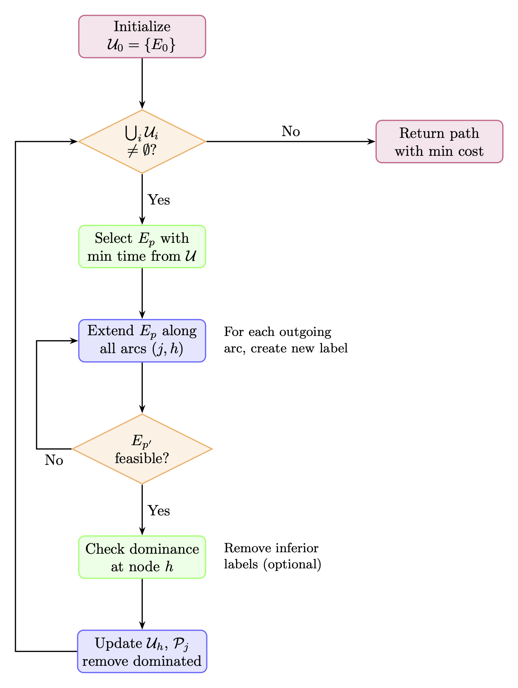

# ESPPTWC Labeling Algorithm

This subpackage implements a labeling algorithm for solving the **Elementary Shortest Path Problem with Time Window Constraints** (ESPPTWC). This is a specialized variant of the more general **Elementary Shortest Path Problem with Resource Constraints** (ESPPRC). While this documentation focuses on ESPPTWC, the underlying algorithmic principles extend naturally to other ESPPRC formulations with different resource types.

## Problem Description

The ESPPTWC seeks the minimum cost path from an origin to a destination node while satisfying:
- **Resource constraints**: Capacity limits, time windows
- **Elementary constraint**: No node repetitions (no cycles)

## Algorithm Overview

The labeling algorithm maintains partial paths (labels) and extends them iteratively. Each label tracks:
- **Cost** (c): Accumulated reduced cost
- **Time** (t): Current time at the node
- **Capacity** (q): Accumulated demand/load
- **Path**: Visited nodes (for elementarity)
- **Path**: Visited nodes (for elementarity)

We illustrate the algorithm's behavior through a series of diagrams below.

### Algorithm Flow

  

## Illustration on Example Instance

Consider a network with 5 nodes (0: origin, 4: destination, 1-3: customers), where:
- Each customer has demand (d) and time window constraints
- Arcs have cost (c) and travel time (τ)
- Vehicle capacity Q = 10

### Step 0: Initialization

  

Initialize with a single label at the origin node 0.

### Step 1: First Extensions

  

Extend the initial label to all reachable neighbors. Three feasible labels are created at nodes 1, 2, and 3.

### Step 2: Extending Further

  

Select the label with minimum time (node 1) and extend. Note that extending to node 2 is **infeasible** due to capacity violation (4 + 7 = 11 > 10).

### Step 3: Dominance

  

When multiple labels reach the same node, **dominance rules** eliminate inferior labels. A label dominates another if it has lower cost, time, and capacity while visiting a subset of nodes.

### Final Solution

  

The algorithm terminates when all labels are processed. The optimal path (0 → 1 → 4) has total cost 11 and satisfies all constraints.

## Key Features

- **Dynamic programming** approach with label extensions
- **Resource feasibility** checks (time windows, capacity)
- **Dominance rules** for pruning (optional but crucial for performance)
- **Elementary paths** guaranteed through visited node tracking

## Usage in Column Generation

This labeling algorithm is used as a pricing subproblem in column generation for vehicle routing problems, where the reduced costs guide the search for improving routes.

